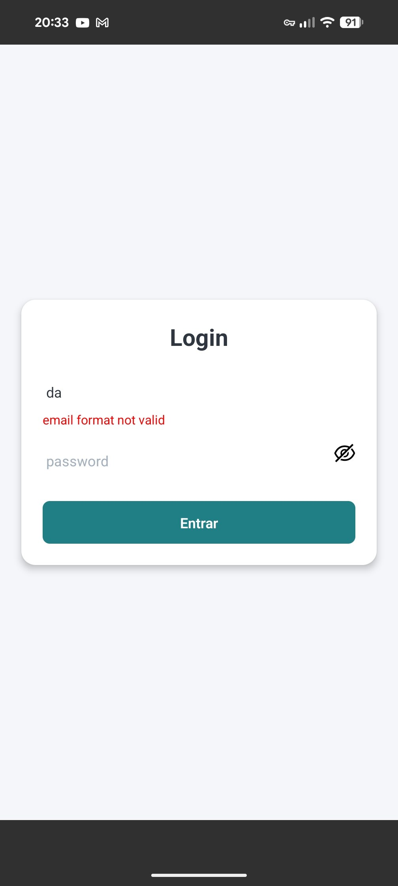
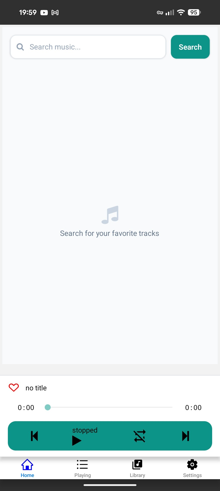
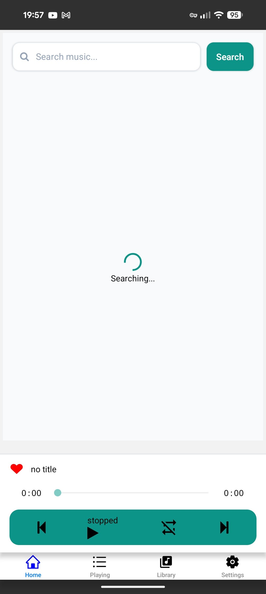
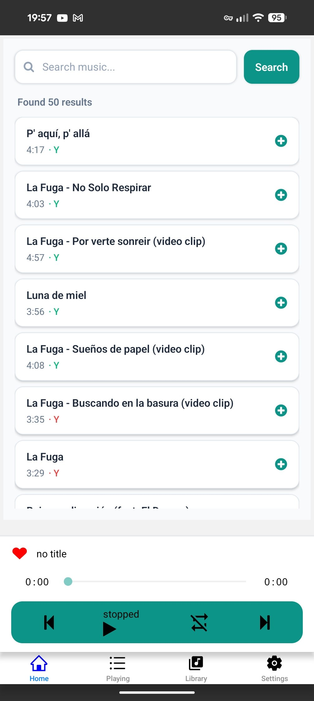

# HearthTune

Music Streaming & Playlist Management Application

## Overview
This application is a full-stack music streaming and playlist management solution featuring a React Native mobile client and a Node.js/TypeScript backend server integrated with GraphQL and MongoDB. It provides multi-source audio playback, intelligent queue management, user authentication, and a modern mobile interface.

---

  
  
  

  
  

## Core Features & Architecture

### 1. Mobile Interface & Playback Experience
* **Modern UI Components:** Clean card layouts with native styling, subtle shadows, rounded borders, and dynamic active-track indicators across playlist and search views.
* **Animated Progress Tracking:** Integrated progress bars on active playlist items that dynamically fill as tracks advance using `react-native-track-player`.
* **Global Audio Controls:** A centralized bottom control bar featuring track progression, like/favorite actions, shuffle, repeat, and play/pause controls.
* **Smart Search System:** Dedicated search interface with responsive inputs, loading indicators, and optimized item actions to add tracks directly to the active queue.

### 2. Audio Engine & Queue Management
* **Multi-Source Audio Support:** Capabilities to handle and stream music from multiple backend data sources and local track detection.
* **Dynamic Queue & Rotation:** Automated queue control functions that support track skipping, shuffling, resetting, and automatically queueing related songs or recommendations upon reaching the end of the playlist.
* **Predictive Buffering:** Logic designed to buffer related songs for smooth, uninterrupted playback transitions.
* **Secure Streaming:** Protected audio delivery leveraging secure signed URL streaming mechanisms.

### 3. Backend, GraphQL & Database Architecture
* **GraphQL API:** Comprehensive queries and mutations managed through a centralized GraphQL client manager to handle song catalog searches and data fetching.
* **Repository Pattern & Persistence:** Clean separation of data layers using Mongoose for robust song and user state persistence in MongoDB.
* **Infrastructure:** Fully containerized setup using Docker for local development and backend execution.

### 4. Authentication & Security
* **JWT & Session Management:** Complete token-based authentication workflow supporting secure login, session handling, and user logout capabilities.
* **User Lifecycle:** End-to-end user invitation, registration flows, and validation logic.
* **Role-Based Access Control (RBAC):** Granular authorization policies securing backend operations and user data.
* **Device Tracking:** Device ID enforcement and secure local storage tracking for enhanced client security.

## Tech Stack
* **Server:** 
    <picture></picture>
    <picture></picture>
    <picture></picture>
    <picture></picture>
    <picture></picture>
    <picture></picture>
    <picture></picture>

* **Mobile:** 
    <picture></picture>
    <picture></picture>
    <picture></picture>
    <picture><picture>
    <picture></picture>